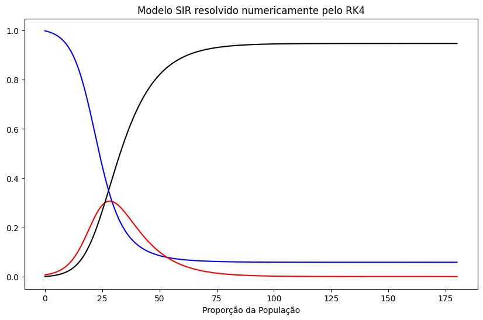
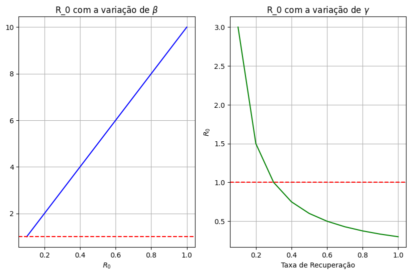

# **Modelo SIR com Runge-Kutta de 4ª Ordem**

---

## **Descrição do Projeto**

Este repositório contém a implementação do Método de Runge-Kutta de 4ª Ordem aplicado à modelagem matemática de um **Modelo SIR Simples** (Suscetíveis, Infectados, Recuperados). Este modelo é amplamente utilizado em epidemiologia para analisar a dinâmica de propagação de doenças infecciosas.

O projeto foi desenvolvido em Python, utilizando bibliotecas populares para processamento numérico e visualização de dados, como **NumPy**, **Matplotlib** e **SciPy**.

---

## **Estrutura do Repositório**

- **`Rungekutta4.ipynb`**: Arquivo Jupyter Notebook contendo a implementação completa do método de Runge-Kutta, do modelo SIR e da visualização gráfica dos resultados.
- **Dependências**: As bibliotecas necessárias para executar o projeto estão descritas na seção **Instalação**.

---

## **Funcionalidades**

1. **Implementação do Método de Runge-Kutta de 4ª Ordem**:
   - Algoritmo numérico eficiente para a solução de equações diferenciais ordinárias.

2. **Simulação do Modelo SIR**:
   - Permite analisar a interação entre as populações suscetíveis, infectadas e recuperadas ao longo do tempo.

3. **Visualização Gráfica**:
   - Gráficos da dinâmica populacional (S, I e R).
   - Gráficos do Número Reprodutivo Básico (R₀) em função das taxas de transmissão (β) e recuperação (γ).

4. **Uso Opcional da Função `odeint` (SciPy)**:
   - Comparação dos resultados obtidos pelo método de Runge-Kutta com uma abordagem alternativa.

## **Gráficos Gerados**

### **Dinâmica Populacional (S, I e R):**
- Representa a evolução das populações ao longo do tempo.

### **Variação do Número Reprodutivo Básico (R₀):**
- Demonstra como mudanças em **β** (taxa de transmissão) e **γ** (taxa de recuperação) impactam o **R₀**.

---

## **Parâmetros e Ajustes**

### **Parâmetros do Modelo:**
- **β (Taxa de transmissão):** Define a frequência de novos casos.
- **γ (Taxa de recuperação):** Define a frequência de recuperação de indivíduos infectados.

### **Condições Iniciais:**
- **S₀:** Proporção inicial de indivíduos suscetíveis.
- **I₀:** Proporção inicial de indivíduos infectados.
- **R₀:** Proporção inicial de indivíduos recuperados.

### **População Total (N):**
- Total de indivíduos na simulação.

---

## **Exemplo de Resultados**

### **Simulação de Epidemias:**
- Comportamento típico de uma epidemia, onde os indivíduos suscetíveis diminuem enquanto os infectados aumentam temporariamente e os recuperados crescem ao longo do tempo.

### **Análise do R₀:**
- Identificação do limite crítico para **R₀ = 1**, usado para prever se a epidemia se espalhará ou diminuirá.

